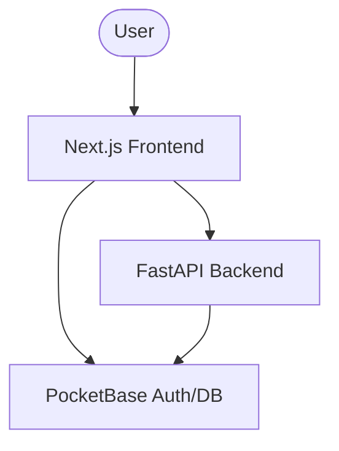

# Developer Guide - MyMailAssistant

Welcome to the MyMailAssistant developer guide. This document provides technical details for developers working on this project.

## Architecture

The application follows a three-tier architecture:

1.  **Frontend (Next.js)**: Responsible for the user interface and client-side logic.
2.  **Auth & Persistence (PocketBase)**: Handles user authentication, file storage, and relational database needs.
3.  **Intelligence Layer (FastAPI)**: Executes complex logic using LangChain and LangGraph, interacting with AI models and processing mail data.

## Service Communication

## Configuration

Environment variables are managed via `.env` files. Copy `.env.template` to `.env` and fill in the necessary values.

## Docker Setup

### Frontend Dockerfiles

- `Dockerfile.dev`: Optimized for development with volume mounting for hot reloading.
- `Dockerfile`: Optimized for production using Next.js standalone output.

### PocketBase Setup

PocketBase is configured to persist data in `pb_data` which is volume-mounted. Migrations are tracked in `pb_migrations`.

### Automatic Admin Setup

The project includes an `entrypoint.sh` for PocketBase that automatically creates an admin account on the first run using `PB_ADMIN_EMAIL` and `PB_ADMIN_PASSWORD` from the `.env` file. If the admin already exists, it will skip this step.

## Development Workflow

1.  **Modifying Frontend**: Changes in `frontend/src` will automatically reload thanks to Docker volume mapping in `docker compose`.
2.  **Modifying Backend**: Changes in `backend/` will reload the FastAPI server.
3.  **PocketBase Migrations**: Use the PocketBase admin UI to make schema changes, then export migrations to `pb_migrations`.

## Commit Convention

This project follows the [Conventional Commits](https://www.conventionalcommits.org/) specification.

### Format
`<type>(<scope>): <description>`

### Types
- `feat`: A new feature
- `fix`: A bug fix
- `docs`: Documentation only changes
- `style`: Changes that do not affect the meaning of the code (white-space, formatting, missing semi-colons, etc)
- `refactor`: A code change that neither fixes a bug nor adds a feature
- `perf`: A code change that improves performance
- `test`: Adding missing tests or correcting existing tests
- `build`: Changes that affect the build system or external dependencies (example scopes: npm, docker)
- `ci`: Changes to our CI configuration files and scripts
- `chore`: Other changes that don't modify src or test files

### Examples
- `feat(auth): add login functionality`
- `fix(backend): correct email parsing logic`
- `docs(readme): update installation steps`
- `build(docker): optimize frontend production image`
