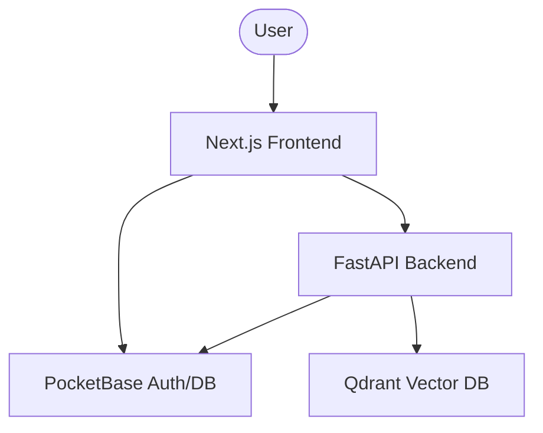

# Developer Guide - MyMailAssistant

Welcome to the MyMailAssistant developer guide. This document provides technical details for developers working on this project.

## Architecture

The application follows a three-tier architecture:

1.  **Frontend (Next.js)**: Responsible for the user interface and client-side logic.
2.  **Auth & Persistence (PocketBase)**: Handles user authentication, file storage, and relational database needs.
3.  **Intelligence Layer (FastAPI)**: Executes complex logic using LangChain and LangGraph, interacting with AI models and processing mail data.
4.  **Vector Search (Qdrant)**: Stores and retrieves high-dimensional vector embeddings for advanced search capabilities.

## Service Communication

## Configuration

Environment variables are managed via `.env` files. Copy `.env.template` to `.env` and fill in the necessary values.

## Docker Setup

### Frontend Dockerfiles

- `Dockerfile.dev`: Optimized for development with volume mounting for hot reloading.
- `Dockerfile`: Optimized for production using Next.js standalone output.

### PocketBase Setup

PocketBase is configured to persist data in `pb_data` which is volume-mounted. Migrations are tracked in `pb_migrations`.

### Automatic Admin Setup

The project includes an `entrypoint.sh` for PocketBase that automatically creates an admin account on the first run using `PB_ADMIN_EMAIL` and `PB_ADMIN_PASSWORD` from the `.env` file. If the admin already exists, it will skip this step.

### Qdrant Collections (Migrations)

Qdrant collections are defined as JSON files in `qdrant/collections/`. On backend startup, the `backend/init_qdrant.py` script ensures all defined collections exist in the vector database. This acts as a migration mechanism for the vector schema.

### Qdrant Authentication

Qdrant is secured using an API key defined by the `QDRANT_API_KEY` environment variable. The Qdrant service receives this as `QDRANT__SERVICE__API_KEY`, and the backend client uses it for all requests.

## Development Workflow

1.  **Modifying Frontend**: Changes in `frontend/src` will automatically reload thanks to Docker volume mapping in `docker compose`.
2.  **Modifying Backend**: Changes in `backend/` will reload the FastAPI server.
3.  **PocketBase Migrations**: Use the PocketBase admin UI to make schema changes, then export migrations to `pb_migrations`.

## Commit Convention

This project follows the [Conventional Commits](https://www.conventionalcommits.org/) specification.

### Format
`<type>(<scope>): <description>`

### Types
- `feat`: A new feature
- `fix`: A bug fix
- `docs`: Documentation only changes
- `style`: Changes that do not affect the meaning of the code (white-space, formatting, missing semi-colons, etc)
- `refactor`: A code change that neither fixes a bug nor adds a feature
- `perf`: A code change that improves performance
- `test`: Adding missing tests or correcting existing tests
- `build`: Changes that affect the build system or external dependencies (example scopes: npm, docker)
- `ci`: Changes to our CI configuration files and scripts
- `chore`: Other changes that don't modify src or test files

### Examples
- `feat(auth): add login functionality`
- `fix(backend): correct email parsing logic`
- `docs(readme): update installation steps`
- `build(docker): optimize frontend production image`

## Coding Conventions

### Next.js & JavaScript/TypeScript

1.  **Function Declarations**: Use the `function` keyword for all function definitions. Avoid arrow functions for component or utility definitions.
    -   *Correct*: `export default function MyComponent() { ... }`
    -   *Incorrect*: `const MyComponent = () => { ... }`
2.  **Logic and Layout Separation**: Always separate logic from layout.
    -   Component files should contain only JSX and layout-related code.
    -   All state, effects, and business logic must be encapsulated in a custom hook.
3.  **Folder Structure**: Components are organized into `features/` and `components/` folders. Each significant component has its own folder containing:
    -   `ComponentName.tsx`: The layout component.
    -   `useComponentName.ts`: The custom hook containing the logic.
    -   `index.ts`: The entry point that exports necessary parts.
4.  **Exports**: Use direct default exports on the function declaration. Avoid `export default ComponentName;` at the end of the file.
5.  **State Management**: Use `useContext` for global or cross-feature state, combined with custom hooks for a clean interface.

### Python

1.  **Readability Above All**: Focus on making code clean, human-readable, and easy to understand.
2.  **File Length**: Keep files concise. Break down files that exceed **100-200 lines**.
3.  **Function Length**: Keep functions small and focused. An internal alert should trigger if a function exceeds **20 lines**.
4.  **Typing**: Use Python type hints consistently and as comprehensively as possible.
5.  **Private Functions**: Prefix internal/private functions and methods with a single underscore `_`.
6.  **Directory Structure**: Maintain an extremely logical directory structure. Regularly evaluate and refactor the structure to ensure it remains intuitive.

## Agent Workflow & Testing

### Git Operations
- **No Automatic Commits**: The AI agent MUST NOT automatically commit or push code.
- **Explicit Approval**: The agent must always ask the user for permission before performing a `git commit` or `git push`.
- **Post-Issue Workflow**: A request to commit and push should be made immediately after each issue or significant task is completed.

### Testing & Quality Assurance
- **Test Everything**: Developers (and the agent) should test the code as extensively as possible to ensure correctness and stability.
- **Verification**: Run local tests, verify UI changes, and check logs before considering a task complete.
- **Reliability**: Prioritize code that is robust and handle edge cases gracefully.
